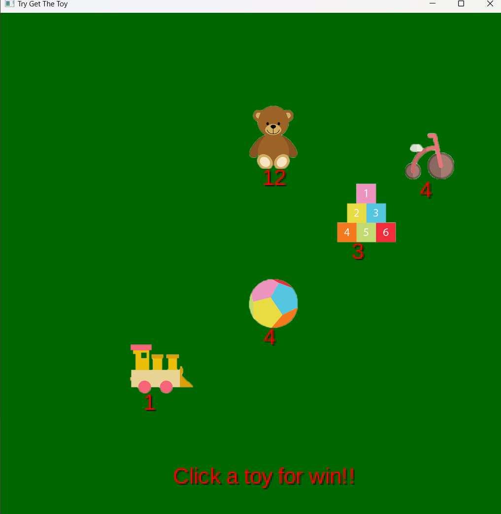
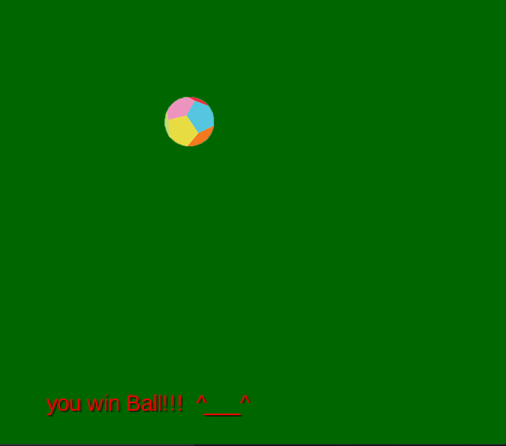

#### Нужно выбивать игрушку кликами. 
Таймер не успел реализовать - с ним было бы логичнее

Красное число под игрушкой - тяжесть выбивания (число кликов)
### ToyAssortment 
```java
package com.gr40in.toy.model;

import com.gr40in.toy.files.GameFilesHandler;

import java.io.FileNotFoundException;
import java.util.HashMap;
import java.util.List;
import java.util.Map;

public class ToyAssortmentImp implements ToyAssortment {

    private GameFilesHandler filesHandler;
    private List<Toy> toysList;
    private Map<Integer, Integer> toysCount;
//    private Map<Toy, Integer> toysMap;


    public ToyAssortmentImp() {
        this.filesHandler = new GameFilesHandler();

        try {
            this.toysList = this.filesHandler.getToysFromGSON();
            this.toysCount = this.filesHandler.getCountFromGSON();
        } catch (FileNotFoundException e) {
            throw new RuntimeException(e);
        }

        System.out.println(toysCount);

    }

    @Override
    public void removeOneToy(Toy toy) {
        this.toysCount.put(toy.getToy_id(), this.toysCount.get(toy.getToy_id() - 1));
        this.filesHandler.save(this.toysCount);
        this.filesHandler.addWinner(toy);
    }

    @Override
    public void change(Toy toy, Integer difficulty) {
        for (int i = 0; i < toysList.size(); i++) {
            if (toysList.get(i).equals(toy)) {
                toysList.get(i).setDifficulty(difficulty);
            }
        }
    }

    @Override
    public void addToy(Toy toy, Integer count) {
        boolean needAdd = true;
        for (Toy t : this.toysList) {
            if (t.equals(toy)) {
                needAdd = false;
            }
        }
        if (needAdd) {
            toysList.add(toy);
            this.toysCount.put(toy.getToy_id(), count);
        } else {
            this.toysCount.put(toy.getToy_id(), count + this.toysCount.get(toy.getToy_id()));
        }
    }

    @Override
    public List<Toy> getToys() {
        return this.toysList;
    }

    @Override
    public Map<Toy, Integer> getAssortment() {

        Map<Toy, Integer> toysMap = new HashMap<>();
        for (Toy toy : this.toysList) {
            toysMap.put(toy, toysCount.get(toy.getToy_id()));
        }
        return toysMap;
    }
}

```


### FileHandler
```java
package com.gr40in.toy.files;

import com.google.gson.Gson;
import com.google.gson.GsonBuilder;
import com.google.gson.reflect.TypeToken;
import com.gr40in.toy.model.Toy;

import java.io.*;
import java.lang.reflect.Type;
import java.util.HashMap;
import java.util.List;
import java.util.Map;

public class GameFilesHandler {
    final private String patchList = "listGSON";
    final private String patchCount = "countMapGSON";
    final private String patchWinners = "WinnersGSON";
    private Gson dump;

    public GameFilesHandler() {
        this.dump = new GsonBuilder().setPrettyPrinting().create();
    }

    public void save(List<Toy> listToSave, String newPatch) {
        try (FileWriter fw = new FileWriter(new File(newPatch))) {
            fw.write(this.dump.toJson(listToSave));
            fw.flush();
        } catch (IOException e) {
            throw new RuntimeException(e);
        }
    }

    public void save(Map<Integer, Integer> toysMapToSave) {
        try (FileWriter fw = new FileWriter(new File(this.patchCount))) {
            fw.write(this.dump.toJson(toysMapToSave));
            fw.flush();
        } catch (IOException e) {
            throw new RuntimeException(e);
        }
    }

    public void addWinner(Toy toy){
        try (FileWriter fw = new FileWriter(new File(this.patchWinners),true)) {
            fw.append(this.dump.toJson(toy));
            fw.flush();
        } catch (IOException e) {
            throw new RuntimeException(e);
        }
    }

    public void saveFull(Map<Toy, Integer> toysMapToSave, String newPatch) {
        try (FileWriter fw = new FileWriter(new File(newPatch))) {
            fw.write(this.dump.toJson(toysMapToSave));
            fw.flush();
        } catch (IOException e) {
            throw new RuntimeException(e);
        }
    }

    public Map<Integer, Integer> getCountFromGSON() throws FileNotFoundException {
        Type type = new TypeToken<HashMap<Integer, Integer>>() {
        }.getType();
//        System.out.println(this.dump.fromJson(new FileReader("mapGSON"), type));
        return this.dump.fromJson(new FileReader("mapGSON"), type);
    }

    public List<Toy> getToysFromGSON() throws FileNotFoundException {
        Type type = new TypeToken<List<Toy>>() {
        }.getType();
//        System.out.println(this.dump.fromJson(new FileReader("listGSON"), type));
        return this.dump.fromJson(new FileReader("listGSON"), type);
    }

}

```